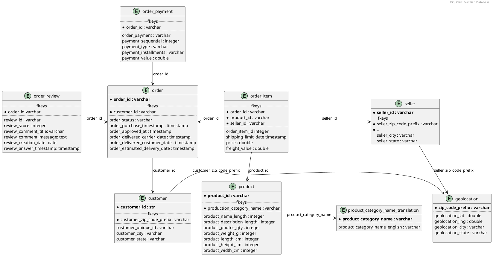

In this hands-on tutorial, you'll set up Apache Superset with a PostgreSQL connection using Docker Compose. Superset is a powerful open-source tool for data visualization and exploration. Docker Compose simplifies running Superset and PostgreSQL in isolated containers with minimal setup. We’ll create a docker-compose.yml file to launch both services together. PostgreSQL will serve as Superset’s metadata database and data source. You’ll learn how to configure the connection between Superset and PostgreSQL inside Docker. By the end, you’ll have a ready-to-use environment for building interactive dashboards. This setup is ideal for quick prototyping or development without complex installs. Let’s get started and bring your data to life with Superset and PostgreSQL!

## How TO

- **First, download the dataset** and save the file in `source_data` :
```bash
path/to/source_data$ curl -L -o brazilian-ecommerce.zip https://www.kaggle.com/api/v1/datasets/download/olistbr/brazilian-ecommerce 
path/to/source_data$ unzip brazilian-ecommerce.zip
...
path/to/source_data$ rm brazilian-ecommerce.zip 
```

_Data model of the [**Brazilian E-Commerce Public Dataset by Olist**][6]_

- fill the `superset.env` and the environment variables necessary for the project with your preferred values.
```shell
# postgres variables
POSTGRES_USER=
POSTGRES_PASSWORD=
POSTGRES_DB=
POSTGRES_PORT=

# pgadmin variables
PGADMIN_DEFAULT_EMAIL=
PGADMIN_DEFAULT_PASSWORD=
PGADMIN_PORT=

# superset variable
SUPERSET_SECRET_KEY=
SUPERSET_PORT=
SUPERSET_ADMIN_USERNAME=
SUPERSET_ADMIN_PASSWORD=
SUPERSET_ADMIN_EMAIL=
SUPERSET_ADMIN_FIRST_NAME=
SUPERSET_ADMIN_LAST_NAME=
```
- When the environment variables are set, build the application with `docker compose` from the project folder :
```shell
path/to/project/folder$ docker compose up -d
...
```
> The build process might be long at first run, so be patient... When everything is up, use your favorite browser and do the following checkups

## Check the database content

- First, check if the database is correctly set up by opening the **pgadmin** web endpoint in your browser : `http://localhost:<PGADMIN_PORT>`. You will have to log in **pgadmin** with the username and the password that you have defined in the `superset.env` file.
```shell
# pgadmin variables
PGADMIN_DEFAULT_EMAIL=***
PGADMIN_DEFAULT_PASSWORD=***
PGADMIN_PORT=***
```
{: w="500"}
_PGAdmin Dashboard : Navigating through your tables_

- You can navigate in your database by setting a connection with the proper variables (the server address is the name of corresponding service container : `postgres`)

```shell
# postgres variables
POSTGRES_USER=***
POSTGRES_PASSWORD=***
POSTGRES_DB=***
POSTGRES_PORT=***
```

{: w="500"}
_PGAdmin Dashboard : Navigating through your tables_

## Create analytics within Superset

- Open the superset endpoint in your browser : `http://localhost:<SUPERSET_PORT>` and add your database `<POSTGRES_DB>`. Use the following variables to log in :
```shell
SUPERSET_PORT=***
SUPERSET_ADMIN_USERNAME=***
SUPERSET_ADMIN_PASSWORD=***
```

- Create a chart showing the number of sales per city
- Create another chart showing the number of products per sellers
- Create a dashboard that contains the above two charts. You are done ! You can play with superset if you dashboard to update itself automatically. 


[6]: https://www.kaggle.com/datasets/olistbr/brazilian-ecommerce "a real-world dataset captures thousands of orders from a large Brazilian e-commerce platform"