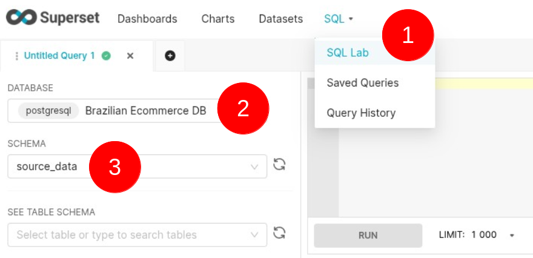

In this hands-on tutorial, you'll set up Apache Superset with a PostgreSQL connection using Docker Compose. Superset is a powerful open-source tool for data visualization and exploration. Docker Compose simplifies running Superset and PostgreSQL in isolated containers with minimal setup. We’ll create a docker-compose.yml file to launch both services together. PostgreSQL will serve as Superset’s metadata database and data source. You’ll learn how to configure the connection between Superset and PostgreSQL inside Docker. By the end, you’ll have a ready-to-use environment for building interactive dashboards. This setup is ideal for quick prototyping or development without complex installs. Let’s get started and bring your data to life with Superset and PostgreSQL!

## How TO

- **Pull the application** from this repository
```bash
$ git clone https://github.com/kanmeugne/modern-data-architectures.git
$ cd modern-data-architecture/handzon-apache-superset
```
- **create a `.env`** with the environment variables necessary for the project
```shell
# postgres variables
POSTGRES_USER=
POSTGRES_PASSWORD=
POSTGRES_DB=
POSTGRES_PORT=

# pgadmin variables
PGADMIN_DEFAULT_EMAIL=
PGADMIN_DEFAULT_PASSWORD=
PGADMIN_PORT=

# superset variable
SUPERSET_SECRET_KEY=
SUPERSET_PORT=
SUPERSET_ADMIN_USERNAME=
SUPERSET_ADMIN_PASSWORD=
SUPERSET_ADMIN_EMAIL=
SUPERSET_ADMIN_FIRST_NAME=
SUPERSET_ADMIN_LAST_NAME=
```
- **Download the dataset** and save the file in `source_data` (you need to do that before building the app) :
```bash
handzon-apache-superset/source_data$ curl -L -o brazilian-ecommerce.zip https://www.kaggle.com/api/v1/datasets/download/olistbr/brazilian-ecommerce 
handzon-apache-superset/source_data$ unzip brazilian-ecommerce.zip
...
handzon-apache-superset/source_data$ rm brazilian-ecommerce.zip
```
</img>

_Data model of the [**Brazilian E-Commerce Public Dataset by Olist**][6]_

- **Build the application** with `docker compose` from the project folder :
```shell
handzon-apache-superset$ docker compose up -d
...
```
The build process might be long at first run, so be patient... When everything is up, use your favorite browser and do the following checkups

- **Check the database content** by opening the **pgadmin** web endpoint in your browser : `http://localhost:<PGADMIN_PORT>`. You will have to log in **pgadmin** with the username and the password that you have defined in the `.env` file.
```shell
# pgadmin variables
PGADMIN_DEFAULT_EMAIL=***
PGADMIN_DEFAULT_PASSWORD=***
PGADMIN_PORT=***
```

_PGAdmin Login Page : use the credentials defined in `.env`_

- **Navigate** in your database by setting a connection with the proper variables (the server address is the name of corresponding service container : `postgis`)

```shell
# postgres variables
POSTGRES_USER=***
POSTGRES_PASSWORD=***
POSTGRES_DB=***
POSTGRES_PORT=***
```


_PGAdmin Connexion,  Navigating through your tables_

## Create analytics within Superset

To be able to create analytics, you should :
- set a database connexion 
- create datasets
- create chart and dashboard

### Create a database connexion

- Open the superset endpoint in your browser : `http://localhost:<SUPERSET_PORT>` and use the following credentials to sign in :
```shell
SUPERSET_PORT=***
SUPERSET_ADMIN_USERNAME=***
SUPERSET_ADMIN_PASSWORD=***
```
</img>

- When signed in, go to `+ > Data > Connect database` to configure a new database connexion
  
</img>

- Click on the `Postgresql` since we are using a Postgresql Database

</img>

- Use the postgresql credentials from the `.env` and click *Connexion*, then *Finish*. 

</img>

Within the tool, you can now query data from the database and build the analytics upon it.

### Create a dataset

- Open the Menu SQL>SQL Lab, select the database connexion you just created on the left panel, and pick the right schema. 

</img>

- In the right panel, copy the following sql code to collect relevant data about orders, products and sellers
```sql
SELECT
    oi.order_id, oi.product_id,
    tr.product_category_name_english as product_name,
    oi.price, oc.customer_city
from olist_order_items_dataset  oi 
     inner join olist_orders_dataset oo on oo.order_id = oi.order_id
     inner join olist_customers_dataset oc on oo.customer_id = oc.customer_id
     inner join olist_products_dataset op on oi.product_id = op.product_id
     left join  product_category_name_translation tr on op.product_category_name = tr.product_category_name
```

</img>

- Save the dataset with the name **orders, products, sellers**

</img>

</img>

Now that we have collected extended data on orders and products, we can can create charts and dashboards

### Create charts

*total sales per city*

- on the dataset tab, click on **orders, products, sellers**
- drag `price` attribute from the left panel and drop it in the *metrics* cell - confirm `SUM(price)` as the agregation operation. 
- drag `customer_city` from the left panel to the *Dimensions* cell. You should see the following chart (see screenshot). Save it as *total sales per city*

</img>

*number of different products per city*

- on the dataset tab, click on **orders, products, sellers**
- use `product_id` as the metric (confirm `COUNT_DISTINCT(product_id)` as the agregation operation), and `product_name` as the dimension. You should see this chart (save it as *number of different products per city*)

</img>

*top 10 sales*
- on the dataset tab, click on **orders, products, sellers**
- use `product_id` as the metric (confirm `COUNT_DISTINCT(product_id)` as the agregation operation), and `product_name` as the dimension. 
- use the `ROW LIMIT` option to limit the number of items to `10`. You should see this chart (save it as *top ten sales*)

</img>

It is now possible to agregate charts into a dashboard to have an overview of your data

### Create a dashboard

- on the dashboard tab, add a new dashboard

</img>

- check on the right pane to see the available charts you can use to build you dashboard (you should see the charts you have created above)

</img>

- drag all your chart from the right pane and drop them anywhere on the dashboard canva

</img>

- Save the dashboard as *Product Sales View*. You should see it on the dashboard tab. 

</img>

I hope this tutorial will be helpful for those who want to play with Apache SuperSet and PostgreSQL. Feel free to send me your comments and remarks.

[6]: https://www.kaggle.com/datasets/olistbr/brazilian-ecommerce "a real-world dataset captures thousands of orders from a large Brazilian e-commerce platform"